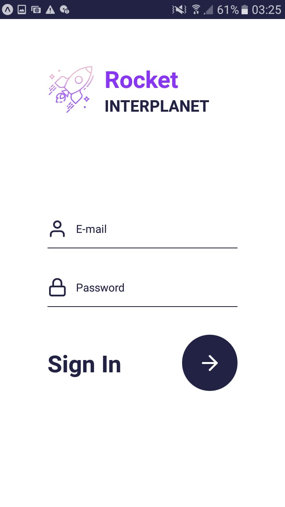

# Rocket Interplanet App

Interplanetary travel app

# Screens

<div>
  <div style="flex-direction: row">
    <div style="flex-direction: column">
      
      
      
      
      
      
    </div>
  </div>
</div>

# Installation

yarn

```bash
yarn install
```

npm

```bash
npm install
```
